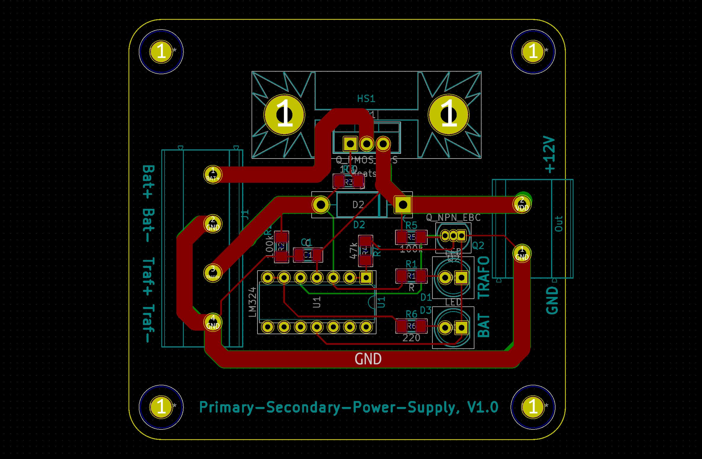

# primary-and-seconary-power-supply
Schema for a primary and secondary power supply (dc, 12-24V)

## Basic idea

Based on two voltage sources, this circuit ensures that one of them is prioritized. The primary power source is a transformer operated by a generator. As soon as the generator is switched off, the second voltage source should be activated. In this case, the second power source is a battery powered by a solar module.

Two LEDs indicate the voltage source. One LED for the transformer (generator) and one for the battery. The voltage sources are designed for 12 or 24 volts.

A P-Channel Mosfet, as an ideal diode, ensures that the battery is only let through when the transformer is switched off. When the transformer is switched on, the mosfet closes and the battery is no longer used. In this case, the battery can be charged by the solar module without consumption.

The circuit can also be realized by a relay, but a higher power consumption by the relay itself must be considered. In addition, a relay usually costs a little more money.

